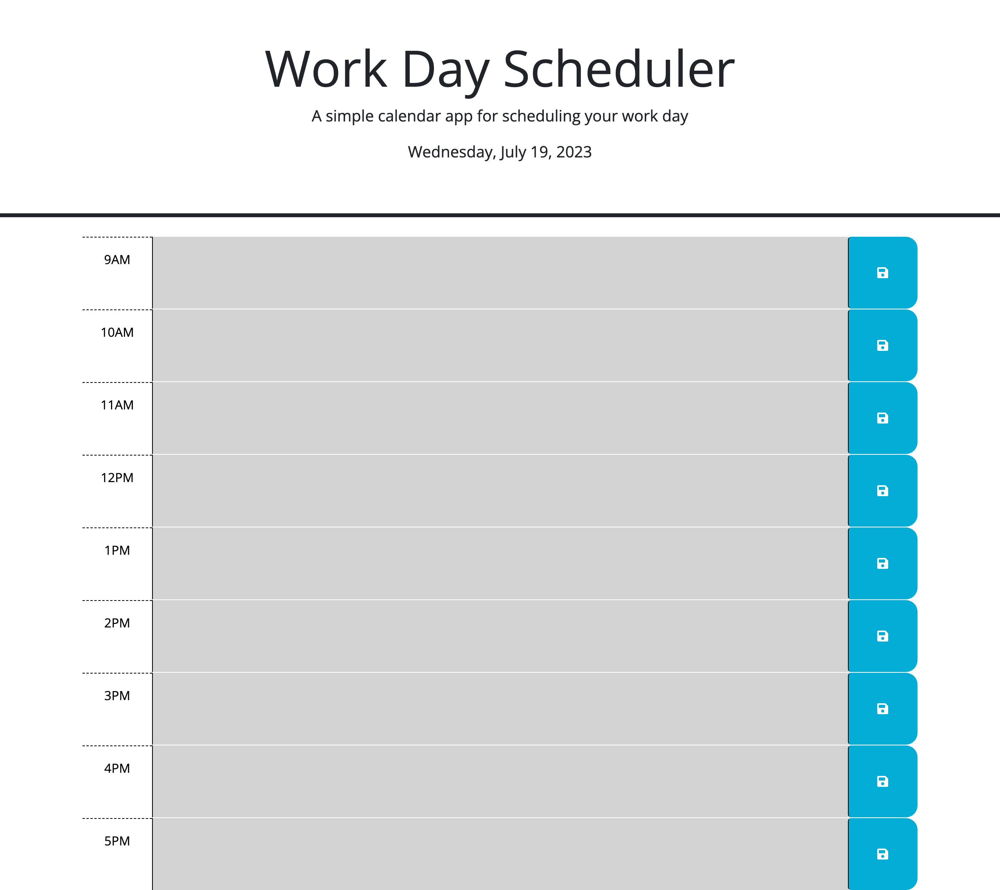

# work-day-scheduler

## Description

In the week 5 challenge we were given the CSS and HTML for a work day scheduler and were tasked with adding functionality to the scheduler using Javascript, jQuery, and Dayjs. The planner has rows, or time blocks, for a typical 9AM to 5PM workday that we were told to modify so that past time blocks would be gray, the present will be red and the future times will be green. Also the scheduler will display the current date and day of the week, as well as saving any text written in the time block when the save button next to it has been pressed.

## Project Link

https://ralstonb9.github.io/work-day-scheduler/

## Screenshot

## Usage

This webpage can be used as a daily planner for your day to day task and it can also be used to see how jQuery and Dayjs can be used in javascript to add functionality to webpages.